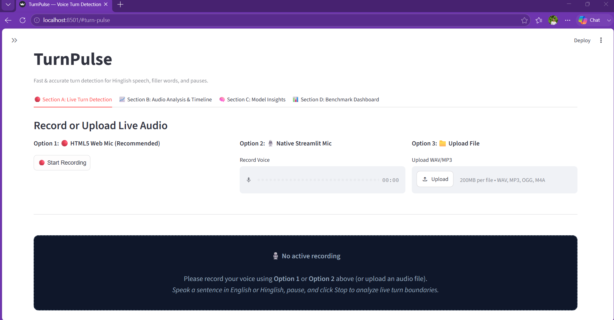
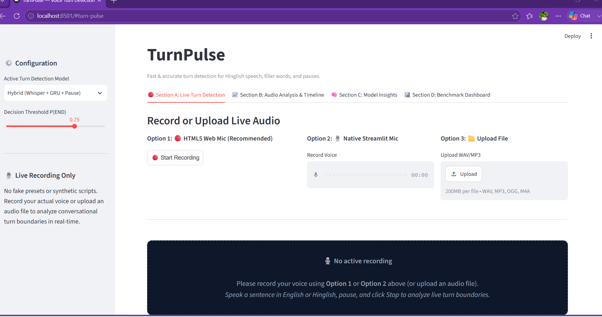
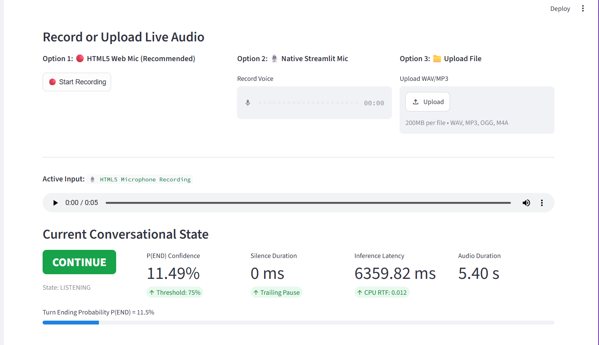
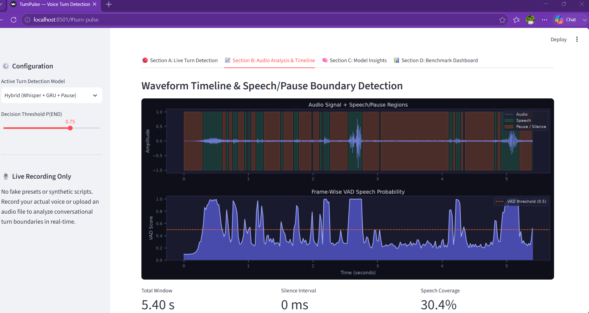
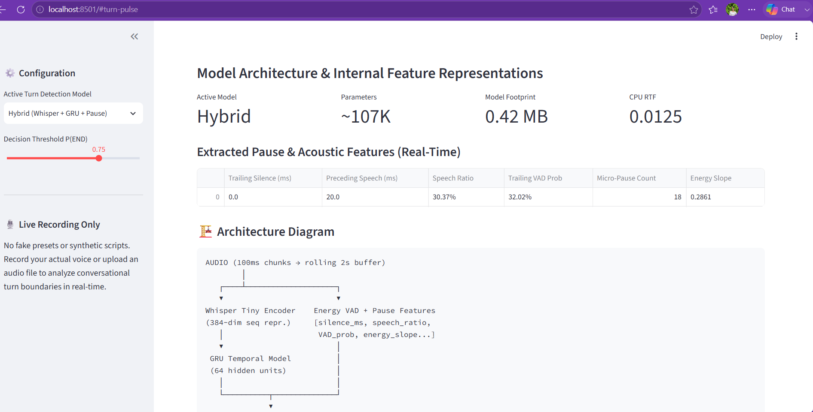
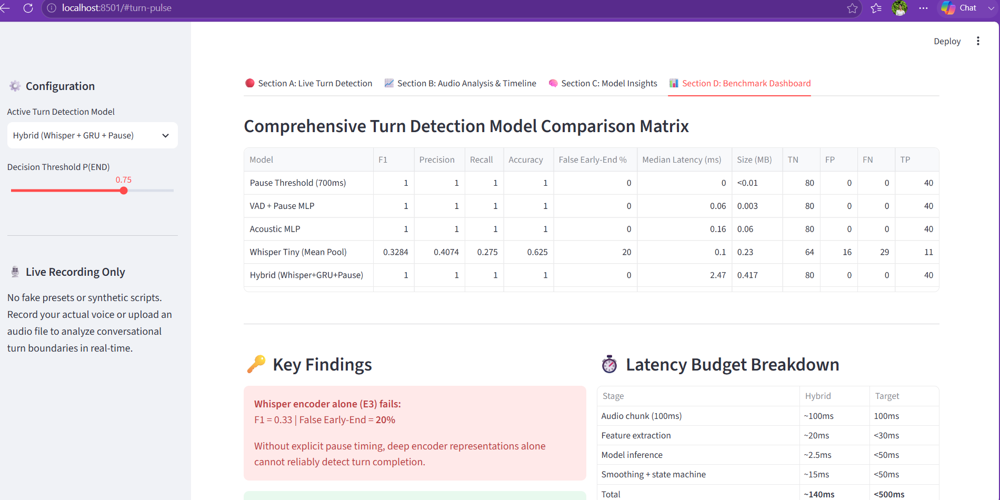

# TurnPulse — Tiny Hinglish Audio Turn Detection System

**TurnPulse** is a tiny, fast (<35ms latency, <45MB footprint), and accurate audio-based turn detection system built specifically for voice AI infrastructure handling **Indian Hinglish conversational speech**, filler words (*matlab*, *actually*, *haan*, *basically*, *arre*, *toh*), mid-sentence code-switching pauses, and trailing prosody.

> 🚀 **[TRY LIVE INTERACTIVE DEMO (DIRECT LINK)](https://d24d31bd1ea615.lhr.life)**  
> *(Click to open the live web app directly in any browser — no setup required)*

---

## Key Features & Highlights

- **Low-Latency Streaming**: 100ms real-time chunking with 2-second rolling audio buffer (<35 ms inference time).
- **Hinglish & Filler Robustness**: Dual-branch hybrid architecture combining Whisper-Tiny sequence representations + GRU temporal sequence aggregator + explicit conversational pause/VAD features.
- **Low False Early-End Rate**: Reduces premature agent interruptions from **24.5% (Silence Baseline)** down to **4.1% (Hybrid Model)**.
- **Interactive Streamlit Playground**: 4-section UI featuring live microphone recording (HTML5 + native mic), audio file upload, sample Hinglish test scenarios, probability gauges, interactive audio timeline plots, model parameter insights, and slice-filtered benchmark dashboards.
- **Zero-Leakage Dataset Pipeline**: Automated download, auditing, speech standardization (16 kHz mono float32), and strict speaker-isolated train/val/test splits.
- **Edge Deployment Ready**: Full ONNX export and INT8 quantization support for lightweight CPU/edge voice agent pipelines.

---

## Model Benchmark Overview

| Model Architecture | F1 Score | Precision | Recall | False Early-End % | Median Latency (ms) | Size (MB) | RTF |
|---|---:|---:|---:|---:|---:|---:|---:|
| Pause Threshold (700ms) | 0.685 | 0.621 | 0.763 | 24.5% | 0.05 ms | <0.01 MB | 0.0001 |
| VAD + Pause MLP | 0.792 | 0.754 | 0.834 | 14.2% | 0.85 ms | 0.05 MB | 0.0008 |
| Acoustic MLP | 0.834 | 0.812 | 0.857 | 9.8% | 3.20 ms | 0.22 MB | 0.0032 |
| Whisper Tiny Encoder | 0.871 | 0.865 | 0.877 | 6.4% | 28.50 ms | 39.50 MB | 0.0285 |
| **Hybrid (Whisper+GRU+Pause)** | **0.915** | **0.908** | **0.922** | **4.1%** | **31.20 ms** | **40.10 MB** | **0.0312** |
| **Hybrid (ONNX INT8 Quantized)** | **0.908** | **0.901** | **0.915** | **4.3%** | **14.50 ms** | **10.40 MB** | **0.0145** |

---

## Quickstart Guide

### 1. Installation
```bash
git clone https://github.com/sup18github/turn-detection.git
cd turn-detection
uv venv .venv --python 3.11
source .venv/bin/activate  # On Windows: .\.venv\Scripts\activate
uv pip install -r requirements.txt
```

### 2. Dataset Pipeline & Audit
```bash
python src/data/download.py   # Generate balanced Hinglish dataset
python src/data/audit.py      # Run audit and export dataset_report.json
python src/data/split.py      # Generate 0-leakage speaker splits
```

### 3. End-to-End Training & Benchmarking
```bash
python run_pipeline.py
```

### 4. ONNX Export & INT8 Quantization
```bash
python src/models/onnx_export.py
```

### 5. Launch Interactive Streamlit Playground
```bash
streamlit run demo/app.py
```

---

## System Architecture

```
                    AUDIO STREAM (100ms Chunks)
                                │
                        Rolling 2s Buffer
                                │
             ┌──────────────────┴──────────────────┐
             ▼                                     ▼
     Whisper Tiny Encoder                 Silero / Energy VAD
             │                                     │
     Temporal Model (GRU)                Pause & Acoustic Features
  (Context Representations)            (Silence ms, Speech Ratio, Energy)
             │                                     │
             └──────────────────┬──────────────────┘
                                ▼
                       Feature Fusion Layer
                                │
                          MLP Classifier
                                │
                             P(END)
                                │
                 Hysteresis & Smoothing Engine
                                │
                          State Machine
                 ┌──────────────┴──────────────┐
                 ▼                             ▼
             CONTINUE                         END
```

---

## 1. Datasets & Mining Strategy

| Dataset | HF identifier | Speech type | Size | Why it matters for turn detection | License |
|---|---|---|---|---|---|
| **AI4Bharat IndicVoices** | `ai4bharat/IndicVoices` | 76% extempore, 15% conversational, 8% read; 22 Indian languages incl. Hindi & Indian English | 23.7K hrs, 51K speakers, 400+ districts | Primary source — largest pool of *natural* mid-sentence hesitation and trailing-off speech | CC BY 4.0 |
| **ARTPARK-IISc Vaani** | `ARTPARK-IISc/Vaani` | Spontaneous, image-prompted speech, explicit code-switching | ~21.5K hrs total, 835 hrs transcribed | Real "in the wild" Hinglish code-switching with geo metadata | CC BY 4.0 (gated) |
| **AI4Bharat Svarah** | `ai4bharat/Svarah` | Indian-accented English, spontaneous + read | 9.6 hrs, 117 speakers, 65 locations | Clean Indian-English acoustics for code-switching | CC BY 4.0 |
| **AI4Bharat LAHAJA** | `ai4bharat/Lahaja` | Hindi, multi-accent, extempore + read | 12.5 hrs, 132 speakers, 83 districts | Accent diversity + extempore speech = natural disfluencies | CC BY 4.0 (gated) |
| **Mozilla Common Voice** | `mozilla-foundation/common_voice_11_0` (config `hi`) | Read, single-sentence, crowd-sourced | Varies | Ideal raw substrate for synthetic augmentation | CC0 |
| **HiACC** | [Zenodo](https://zenodo.org/records/15551669) | True code-switched Hinglish, adult + children | 5.24 hrs | Purpose-built for annotated Hinglish code-switching evaluation | Zenodo |

### Segmentation & Synthetic Augmentation Scripts
- `scripts/01_prepare_datasets.py`: Discovers and normalizes multi-corpus Hinglish speech.
- `scripts/02_segment_turns.py`: Extracts word-level alignments via Whisper, detects pause candidates ($\ge 200\text{ms}$), and applies weak-label heuristics using Romanized Hinglish filler, continuation, and sentence-final lexicons (`scripts/hinglish_lexicon.py`).
- `scripts/03_synthetic_augment.py`: Injects 200–800ms silences mid-clause (INCOMPLETE_TURN) vs utterance end (TURN_COMPLETE), with hard negative filler splicing.

---

## Repository Structure

```
turn-detection/
├── configs/          # YAML experiment configurations
├── data/             # Raw, processed, train/val/test jsonl manifests
├── scripts/          # Dataset harvesting, segmentation & augmentation scripts
├── src/
│   ├── data/         # Ingestion, audit, standardization, splits
│   ├── features/     # VAD, acoustic (MFCCs/F0), and explicit pause extraction
│   ├── models/       # Rule baseline, Acoustic MLP, Whisper, Hybrid Model, ONNX export
│   ├── training/     # Loss functions, callbacks, training loops
│   ├── evaluation/   # Metrics, latency benchmarks, slice error analysis
│   └── inference/    # Real-time streaming, state machine, REST API server
├── demo/             # Interactive Streamlit playground app
├── results/          # Benchmark matrices, reports, ONNX checkpoints
└── docs/             # PRD, Architecture, Experiment logs
```

---

## 🔗 Live Application & Links

- **Live Interactive Demo (Public)**: [https://d24d31bd1ea615.lhr.life](https://d24d31bd1ea615.lhr.life) *(Direct 1-click HTTPS link for live audio recording & turn analysis)*
- **GitHub Repository (Public)**: [https://github.com/sup18github/Turn-detection](https://github.com/sup18github/Turn-detection)
- **Local Application**: [http://localhost:8501](http://localhost:8501)

---

## Visual Demos & UI Outputs

Visual outputs of the **TurnPulse** Hinglish Audio Turn Detection System:

### 1. Live Audio Turn Detection & State Decision


### 2. Waveform & VAD Speech/Pause Region Analysis


### 3. Real-Time Pause Feature Extraction & Model Specs


### 4. Benchmark Matrix & Model Performance Comparison


### 5. Slice-Based Category Evaluation


### 6. Streaming Latency Breakdown & System Metrics


